# Spatial carbon opportunity cost calculation method

**Method version 7.3 — data release v1.0.0**

The carbon opportunity cost (COC) of a crop is the carbon that the land it occupies would hold in its
native state, but loses under agriculture, expressed per year (Searchinger et al. 2018). WRI's COC
calculation tool computes it from spatially explicit inputs that are aggregated to default factors by
product and broad geography. This spatial method preserves spatial detail throughout: the carbon-stock
difference and the COC are calculated for each crop in each grid cell *before* any results are aggregated.
That makes it possible to map variation within countries and regions, and to summarize the same underlying
results at different spatial scales.

This document describes **version 7.3**, the final version of the spatial calculation developed in 2026, as
published in data release v1.0.0. Every carbon pool comes from a spatially explicit source rather than from
a tabular factor distributed across a geography key, and organic (peat) soils are handled outside the
carbon-stock framework. The definitions of COC, the carbon-loss approach, the carbon pools, the
carbon-to-CO2 conversion and annualization follow the COC tool; results use a 30-year annualization period,
which is a single constant in the code ([coc/constants.py](../coc/constants.py)). The method covers the 46
primary crops in MapSPAM; livestock and processed products are not spatialized.

Known limitations are collected in [limitations.md](limitations.md), the output files in
[outputs.md](outputs.md), the input datasets and their licenses in [data_sources.md](data_sources.md), and the
earlier versions in [version_history.md](version_history.md).

## Spatial grid and analytical unit

All inputs are harmonized to the grid of MapSPAM (Spatial Production Allocation Model) 2020 Version 2
Release 2 (V2r2; IFPRI 2026): a global 5 arc-minute grid, about 9 km at the equator, with 4,320 columns and
2,160 rows in WGS 84 geographic coordinates (EPSG:4326). Every input is aligned to the same coordinate
reference system, extent, resolution and cell boundaries before the COC is calculated.

Carbon stocks are in tonnes of carbon per hectare (tC/ha) and yield in tonnes of product per hectare per
year (t/ha/year). These are intensive variables, represented by the value applying to each grid cell. Crop
physical area is extensive: hectares within each grid cell. Keeping that distinction is necessary when
resampling inputs and aggregating outputs.

For each crop *p* and grid cell *i*, the method first calculates the difference between native and
agricultural plant and soil carbon stocks,

**Equation 1 | Carbon opportunity cost per hectare (tCO2e/ha/year)**

$$
COC_{h,p,i}=\frac{44}{12}\cdot\frac{\Delta C_{p,i}}{A},\qquad
\Delta C_{p,i}=\left(C^{np}_{i}+C^{ns}_{p,i}\right)-\left(C^{ap}_{p,i}+C^{as}_{i}\right)
$$

where $C^{np}$, $C^{ns}$, $C^{ap}$ and $C^{as}$ are native plant, native soil, agricultural plant and
agricultural soil carbon (tC/ha), and $A$ = 30 years. The COC per tonne of product uses the cell's yield
$Y_{p,i}$:

**Equation 2 | Carbon opportunity cost per tonne of product (tCO2e/t)**

$$
COC_{t,p,i}=\frac{COC_{h,p,i}}{Y_{p,i}}
$$

and the total annual COC in the cell scales the per-hectare cost by the crop's physical area $PA_{p,i}$:

**Equation 3 | Total annual carbon opportunity cost (tCO2e/year) of a crop in a grid cell**

$$
COC_{total,p,i}=COC_{h,p,i}\times PA_{p,i}
$$

The carbon-stock difference is kept as a signed value; negative differences are not set to zero. A negative
value occurs where the agricultural plant and soil stocks exceed the native stock, a situation most often
seen in arid regions, where irrigated agriculture can raise soil carbon above that of the native
vegetation. In version 7.3 negative values are rare: 2.5 percent of costed cropland, and −37 MtCO2e/year
against a global total of 17,462 MtCO2e/year.

## Data sources

### How the sources were selected

Sixteen versions of the spatial calculation were built and compared during development, version 7.3
being the last (see [version_history.md](version_history.md)). Each changed **one** input from its parent, so the difference
between adjacent versions is attributable to that input alone. Five principles emerged from those
comparisons, and they determine the sources in Table 1.

**1. Both sides of a difference must share a baseline.** The COC is a subtraction, so a data source is only
ever admissible *as half of a pair*. Two carbon products can each be defensible and still be
uninterpretable when differenced, because published soil-carbon products disagree on level by nearly a
factor of two: intercomparisons span 577–1,171 Pg C over the top 30 cm, and the two products used in the
intermediate versions of this work differ by about 1.8× (833 against 466 Gt C on a common extent).
Differencing across that offset measures the offset, not land-use change. Where native soil carbon came from
one product and agricultural soil carbon from another, the soil term went negative over roughly a fifth of
global cropland, and on drained organic soils it reached −136 tC/ha: a carbon *credit* precisely where the
opportunity cost should be largest. Version 7.3 therefore derives both soil stocks from a single measured
layer, which removes the level offset by construction.

**2. Prefer a measured, cell-varying source, but only at a resolution the grid can carry.** Where a
spatially explicit product exists that can be placed on the grid without inventing detail, it is preferred
to a tabular factor distributed across a geography key, because the point of the spatial method is to show
variation within regions rather than steps at administrative borders. No source is used at a resolution
finer than the calculation can express: the agricultural soil layer is produced at 30 m, but crop
distributions are known only at 5 arc-minutes, so the soil value is a cell mean shared by every crop in the
cell.

**3. Match the pool definition and the reference year on both sides.** Depth, the above-/below-ground
boundary and the year have to agree across the subtraction, or the difference carries an accounting
artifact rather than a land-use signal. Both soil stocks are 0–100 cm; the agricultural soil epoch
(2015–2020) is the one closest to the 2020 reference year of the crop data; and agricultural plant carbon
includes below-ground biomass because the native plant layer does.

**4. Use the right dimension for the process.** Every carbon pool is a *stock* (tC/ha) that the method
differences and spreads over *A* years. Drained organic soil does not behave that way: peat oxidizes
continuously for as long as the drainage lasts, so the IPCC expresses it as an annual *flux*. Dividing an
already-annual rate by 30 would understate it thirty-fold, so organic soils leave the stock-difference
framework entirely rather than being patched inside it.

**5. Keep every choice attributable.** Sources were changed one axis at a time, and every result is written
with a machine-readable record of which source fed which pool (`results/run.json`), so any number can be
traced to its inputs and any single choice can be reversed and re-run.

**Table 1 | Data sources, version 7.3**

| Input | Source | Why this source |
|---|---|---|
| Crop physical area, harvested area, yield | MapSPAM 2020 V2r2 (IFPRI 2026), all production systems | The only global product that disaggregates national agricultural statistics to a grid for a large crop set; the same database the COC tool uses |
| Native plant carbon | Erb et al. (2018), five-map mean, by grid cell | The COC tool's own source, and already gridded; keeping its cell-to-cell variation costs nothing and adds detail |
| Native soil carbon | COC tool Table A-9 loss factors run backwards on the measured agricultural soil layer, keyed by Dinerstein et al. (2017) biome × annual/perennial crop | The only construction that is self-consistent with a measured agricultural soil stock *and* leaves a soil term of realistic size (Principle 1) |
| Agricultural plant carbon | Best available per crop: Cao et al. (2026) gridded residue + yield dry matter for 29 crops; IPCC (2019) Table 5.3 for rubber; COC tool Table A-8 factors for the rest | The only gridded, crop-specific biomass product covering most of the crop set; includes below-ground biomass, matching the native plant layer (Principles 2 and 3) |
| Agricultural soil carbon | OpenLandMap-soildb, 0–100 cm, 2015–2020 (Hengl et al. 2026) | A measured, cell-varying stock at the depth and reference year needed (Principles 2 and 3) |
| Organic (peat) soils | WRI/GFW AFOLU organic-soils flux model v1.0.1, 2016–2020: drained organic soil under agricultural land uses, priced with its IPCC CO2 + N2O emission factors | The only global product giving *drained* extent, *land use* and a stratified emission factor together, which the flux treatment requires (Principle 4) |

### Crop physical area and yield

Crop distribution, physical area, harvested area and yield all come from MapSPAM 2020 V2r2 (IFPRI 2026), the
same database the COC tool uses. It is the only global product that disaggregates national agricultural
statistics to a grid for a large crop set, and using the tool's own database keeps the spatial factors
comparable with the tool's defaults. The calculation covers MapSPAM's 46 crops.

**All production systems are in scope**: irrigated (I), rainfed high-input (H), rainfed low-input (L) and
rainfed subsistence (S). The reason is internal consistency. The agricultural plant carbon source reports
biomass for *all* production including subsistence, and its density is that biomass divided by
all-system physical area; aggregating an all-systems density over commercial-only area would apply a
denominator the numerator does not match, inflating the density by up to about 55 percent for some crops.
The cost is that subsistence production, which carries disproportionately high per-tonne factors because of
its low yields, is inside the reported factors (see [limitations.md](limitations.md)).

MapSPAM publishes, for every crop, an all-system layer (`_A`) alongside the per-system layers. The
calculation reads the all-system layers directly:

**Equation 4 | Crop physical area (ha) in a grid cell**

$$
PA_{p,i}=PA_{p,i,A}\;\left(=PA_{p,i,I}+PA_{p,i,H}+PA_{p,i,L}+PA_{p,i,S}\right)
$$

MapSPAM reports yield as production per unit of harvested area, so the all-system yield is the combined
production divided by the combined harvested area, i.e. the harvested-area-weighted mean of the system
yields:

**Equation 5 | Crop yield (t/ha/year) in a grid cell**

$$
Y_{p,i}=\frac{P_{p,i}}{H_{p,i}}=\frac{\sum_{k\in\{I,H,L,S\}}Y_{p,i,k}\,H_{p,i,k}}{\sum_{k\in\{I,H,L,S\}}H_{p,i,k}},
\qquad P_{p,i}=Y_{p,i,A}\times H_{p,i,A}
$$

where *H* is harvested area and *P* production. Yields are converted from kg/ha to t/ha. Physical area, the
land the crop occupies, scales COC per hectare to a cell total (Equation 3); harvested area, which also
counts repeat harvests on the same land, is the weight for yield.

*Public versus internal release.* The development runs summed the four system layers of MapSPAM's internal
release. The public release ships only the all-system (`_A`), irrigated and rainfed layers, so v1.0.0 reads
`_A`, which is pixel-identical between the two releases. MapSPAM's `_A` differs from the sum of its own
system layers by 0.0005 percent of global area; this moves the v1.0.0 global total by −0.0006 percent and no
crop by more than 0.06 percent against the development build, and lets anyone reproduce the results from
public data.

### Carbon-stock inputs

#### Native plant carbon

Native plant carbon is the mean of the five potential-vegetation biomass carbon maps of Erb et al. (2018),
the same input the COC tool uses. It is already a global gridded product covering above- and below-ground
biomass, so no spatialization step is needed and none of its detail has to be invented. The maps are
converted from grams of carbon per square meter to tC/ha, aligned to a common set of cell coordinates,
averaged and written to the grid ([pipeline step 02](../pipeline/02_native_plant_carbon.py)). Unlike the
COC tool, which aggregates this input to regional averages, the spatial method keeps its cell-to-cell
variation.

#### Native soil carbon

Native soil carbon is the one pool that cannot be measured, because the native state no longer exists where
cropland is. Three constructions were built and compared on otherwise identical inputs:

- an independent gridded model of natural soil carbon (LPJmL), differenced against the measured agricultural
  layer;
- a pair of layers from a single model run (Sanderman et al. 2017), one with land use and one without;
- the COC tool's own **Table A-9** soil-carbon loss factors run *backwards* on the measured agricultural
  stock.

The first fails Principle 1: native and agricultural layers are independently calibrated, and differencing
across their level offset gives a soil term that is negative over 19.7 percent of cropland and −136 tC/ha on
drained organic soils. The second satisfies Principle 1 but leaves almost nothing: one model differenced
against itself collapses the soil term from 36.0 to 8.8 tC/ha (area-weighted over cropland), so the sign
error is repaired but the soil pool stops carrying information.

Version 7.3 uses the third. Table A-9 gives the *fraction* $f$ of native soil carbon lost on conversion to
agriculture, by native biome and agricultural land-use type. The tool applies it forwards, from native to
agricultural. Reversed, it takes the measured present-day stock as given and infers the native one:

$$
C^{ns}=\frac{C^{as}}{1-f},\qquad C^{ns}-C^{as}=C^{as}\,\frac{f}{1-f}
$$

The soil term becomes a fixed multiple of the measured agricultural stock, set by biome and by whether the
crop is annual or a permanent tree or bush crop. Because the relationship is multiplicative rather than a
difference of two independently calibrated products, it is self-consistent *and* the soil term survives, at
17.6 tC/ha, between the two alternatives ([pipeline step 07](../pipeline/07_a9_reverse_native_soil.py)).

The biome mask is not an approximation of the tool's geography. The code released with Wirsenius et al.
(2025) builds its biome raster from Dinerstein et al. (2017) `Ecoregions2017` on the identical 4,320 × 2,160
grid, so the factors are applied in the frame of reference in which they were tabulated
([pipeline step 06](../pipeline/06_biome_mask.py)). Dinerstein's 14 biomes are collapsed to the 6 classes for
which Table A-9 states factors; the four biomes with no clean row (boreal, flooded grassland, tundra,
mangrove) together carry 2.4 percent of cropland. The perennial column applies to 12 unambiguous woody crops;
three mixed or ratooned categories stay on the annual column. The factor is applied to the full 0–100 cm
stock.

**What this choice gives up.** Native soil carbon stops being an observation: it is present-day soil carbon
times a biome constant, so the soil term carries an assumption of proportional loss, not independent
evidence about the native state. This is the largest single concession in version 7.3. It was accepted
because the alternatives are worse in ways that are harder to bound: a wrong sign on drained peat, or no
soil term at all.

#### Agricultural plant carbon

Assembled per crop from the best source available for that crop, because no single product covers the
crop set ([pipeline steps 03–04](../pipeline/04_cornell_ag_plant.py)):

- **Cao et al. (2026)** supply gridded residue and yield dry matter for 29 crops. Their sum is converted to
  carbon with the IPCC default carbon fraction of 0.47, halved to turn a peak standing stock into a
  time-averaged one, and divided by all-system physical area to give tC/ha. Below-ground residue is
  deliberately included, because the native plant layer is above- *and* below-ground and both sides of the
  difference must cover the same pools (Principle 3). Where this layer has no value in a cell, the COC
  tool's value is used there.
- **Rubber** has no Table A-8 row and no factor in the COC tool, whose concordance would otherwise give it
  an all-crop mean of about 4.2 tC/ha, roughly a tenth of its real standing stock. IPCC (2019 Refinement,
  Volume 4, Chapter 5, Table 5.3) gives a time-averaged 40.1 tC/ha over a 27-year cycle, used instead.
- **The remaining crops**, mostly tree and bush crops outside Cao et al.'s coverage, keep the COC tool's
  Table A-8 factors, distributed through the tool's regions.

Coverage is complete across all 46 crops: the gridded source wherever it exists, the tool's own values as
the fallback.

#### Agricultural soil carbon

Agricultural soil carbon is taken from OpenLandMap-soildb (Hengl et al. 2026), which combines soil
observations with machine-learning predictions of soil properties, including soil organic carbon density, at
30 m. It is a *measured* stock rather than a modeled or tabulated one, it varies cell to cell, and it can be
assembled to the calculation's requirements: the **2015–2020** epoch is the closest to the 2020 reference
year of the crop data, and the 0–30, 30–60 and 60–100 cm layers are summed to the top meter, matching the
native soil stock's depth ([pipeline step 05](../pipeline/05_openlandmap_soc.py)).

It is not crop specific, so every crop in a cell gets the same soil carbon, and its value is a *cell mean*,
which matters where a cell contains organic soil (see [limitations.md](limitations.md)).

#### Organic (peat) soils

Organic soils are the one input that is not a carbon stock, and they are handled outside the stock-difference
framework (Principle 4): drained peat oxidizes continuously for as long as the drainage lasts, so the IPCC
prices it as an annual flux rather than as a one-off stock change. The problem this solves is specific. A
measured agricultural soil layer registers the large carbon stock still present in drained peat, while no
native-soil construction represents peat; the two sides of the subtraction then rest on different baselines,
and cropland on drained peat earns a carbon credit. Suppressing the soil term on the peat fraction is not
enough: the pool has to be repriced, not zeroed.

For the drained organic share $f_i$ of a cell's cropland, the soil stock difference is therefore **replaced**
by the drainage flux, while the plant term is kept, since clearing a peat swamp forest still forgoes its
biomass:

**Equation 6 | Carbon opportunity cost per hectare (tCO2e/ha/year) with the organic-soil carve-out**

$$
COC_{h,p,i}=(1-f_i)\,\frac{44/12}{A}\,\Delta C_{p,i}
\;+\;f_i\left[\frac{44/12}{A}\left(C^{np}_{i}-C^{ap}_{p,i}\right)+EF_i\right]
$$

where $EF_i$ is the cell's drainage emission factor in tCO2e/ha/year. The flux is not divided by $A$,
because it is already annual. Because the soil pair is dropped rather than kept alongside the flux, the same
carbon is never counted twice; on the cells where every cropped hectare is drained peat, the result equals
the plant term plus the emission factor exactly, for every crop.

**Why the WRI/GFW model supplies both the extent and the price.** A first treatment crossed a global
peatland map (PEATMAP) with a single flat IPCC drainage factor. It fixes the sign, but the peat map says where
peat *is*, not whether it is drained or what grows on it, so drainage under forestry, settlement and
grassland is charged to crops; one tropical factor is applied worldwide; and it covers CO2 only. The WRI/GFW
AFOLU organic-soils flux model (version 1.0.1) addresses all three
([pipeline step 08](../pipeline/08_gfw_peat_flux.py)):

- **The extent is land-use aware.** Of the drained organic soil the model maps in 2016–2020, forest,
  settlement and grassland drainage are excluded, and only cropland, oil palm and other plantation are
  kept: 22.0 million hectares. Grassland is dropped because the method has no pasture.
- **The emission factor is stratified**: 34.6 tCO2e/ha/year on boreal and temperate cropland, 53.5 on
  tropical cropland, 40.9 on oil palm, and 56.1 and 74.4 on tropical long- and short-rotation plantations.
- **Nitrous oxide is included** alongside CO2, at a 100-year global warming potential of 273. Off-site
  dissolved-organic-carbon CO2, methane and fire are published by the model and all excluded, so this is a
  lower bound on the model's own total.

These are the IPCC 2013 Wetlands Supplement factors, the same values used in the published tool
documentation; the model is a better *extent and land-use allocation* of the same factors. The build
reproduces the model's own published totals to within +0.2 percent (22.038 against 22.004 million hectares,
949.9 against 948.0 MtCO2e/year), the residual being the analytic pixel-area calculation.

Two decisions inside this source are worth stating. First, the drained fraction is read **relative to crop
area**, not cell area. Multiplying a cell-area fraction by crop density would be an independence assumption:
right for a peat map that knows nothing about land use, wrong for a layer already filtered to agricultural
classes, because it discounts the same information twice. The median crop density on cropped cells carrying
drained agricultural peat is 15.0 percent, so the cell-area reading would cost 8.6 of the model's 22.0
million hectares (39 percent), against 15.7 (71 percent) for the crop-relative reading: 0.25 GtCO2e/year on
the global total. The remaining 29 percent is a genuine disagreement between the two products about how much
land is cropped, and the cap at 1 refuses to invent hectares MapSPAM does not have. Second, the **2016–2020**
period is used, the one matching MapSPAM 2020. The model's land-use labels for 2011–2015 and 2016–2020 were
defective until WRI corrected them in place on 26 August 2026; version 7.3 was first built on 2021–2024
because of that, and rebuilt on 2016–2020 after the correction (+0.002 GtCO2e/year).

### Aggregation

All calculations are carried out on the grid cells defined by MapSPAM. For each cell, the method computes the
native and agricultural carbon stocks, the stock difference, the organic-soil adjustment where it applies,
COC per hectare and COC per tonne. For each crop it writes three GeoTIFFs: COC per hectare, COC per tonne and
total annual COC. A crop's result is valid only where the crop occurs and every input is available; a
per-tonne result also needs a positive yield.

Results are aggregated only after the cell-level calculation. When aggregating to a coarser geography, such
as a country, cell totals are summed and divided by the summed physical area or production, never by
averaging cell values: carbon stocks and COC per hectare are physical-area-weighted; yield is total
production over total harvested area; and COC per tonne is total annual COC over total production. These
rules preserve what each input represents and avoid treating equal-angle grid cells as if they held equal
areas of cropland ([coc/national.py](../coc/national.py)).

Administrative geography, for aggregation and for distributing the tool's tabular factors, comes from
GADM 4.1 country polygons rasterized to the grid ([coc/geography.py](../coc/geography.py)): the 157
countries of the tool's Table A-1 plus 36 sovereign countries with cropland that Table A-1 omits, each
assigned to a tool region. GADM's nine disputed zones (Z01–Z09) are folded into the country GADM itself names
for each, so that cropland (chiefly in Jammu and Kashmir) carries the geography of India, China or Pakistan
rather than falling outside the key.

The national and regional tables are in the COC tool's own column format, beside the tool's factors, so the
two can be compared row by row: 43 tool crop items across 164 countries and 11 regions (Global and the 10
Table A-1 regions). The carbon-stock difference rebuilt during aggregation agrees with the per-hectare rasters
to within 10⁻² tC/ha (asserted), and the national tables recover 17.453 of the global 17.462 GtCO2e/year,
**99.95 percent**, the shortfall being cropland the calculation costs but no country polygon covers. One
identity the tool satisfies does not hold here, and should not be expected to: on cells carrying drained
organic soil, the four stock columns stay at their mineral values while the total carries the drainage flux,
so the columns no longer add up to the total.

## Results (v1.0.0)

**Table 2 | Global results**

| Quantity | Value |
|---|---:|
| Total annualized carbon opportunity cost | 17.46 GtCO2e/year |
| Global mean COC per tonne of product | 1.88 tCO2e/tonne |
| Production covered | 9.29 Gt/year |
| Crop physical area in scope | 1,274.4 Mha |
| Physical area actually costed | 1,264.7 Mha (99.2 percent) |
| Cropland costed as drained organic soil | 15.7 Mha |
| Grid cells with a result | 971,448 (10.4 percent of the global grid) |
| Cropland carrying a negative COC | 31.5 Mha (2.5 percent), −37 MtCO2e/year |

Coverage is close to complete: 99.2 percent of the crop area in scope receives a cost, so the global total is
not set by which cells drop out.

**Table 3 | The ten crops with the largest total carbon opportunity cost**

| Crop | Total COC (MtCO2e/year) | COC per tonne (tCO2e/t) | Physical area (Mha) | Area costed as peat (Mha) |
|---|---:|---:|---:|---:|
| Maize | 2,425 | 2.08 | 176.5 | 0.55 |
| Rice | 2,077 | 2.73 | 109.5 | 0.61 |
| Wheat | 1,860 | 2.45 | 194.4 | 1.61 |
| Soybean | 1,631 | 4.61 | 119.5 | 0.11 |
| Oil palm | 990 | 2.40 | 27.4 | 7.33 |
| Other vegetables | 667 | 0.80 | 39.0 | 0.09 |
| Barley | 505 | 3.30 | 50.1 | 1.20 |
| Rapeseed | 451 | 6.26 | 35.7 | 0.39 |
| Sugarcane | 440 | 0.24 | 26.1 | 0.05 |
| Cassava | 430 | 1.43 | 22.0 | 0.02 |

Per-tonne factors span two orders of magnitude across the 46 crops, from 0.23 tCO2e/t for sugarbeet and 0.24
for sugarcane to 32.5 for cocoa, 22.1 for rubber and 22.0 for robusta coffee. The ordering is driven by yield
as much as by carbon: the high-factor crops are low-yielding perennials grown in high-carbon landscapes, the
low-factor crops high-tonnage annuals.

**Where the organic-soil treatment acts.** Against the same calculation without the carve-out (version 7.2),
it adds 0.56 GtCO2e/year, 3.3 percent of the global total, over 15.7 Mha. It is highly concentrated: oil palm
alone accounts for 7.3 Mha and about +280 MtCO2e/year, almost all of it in Indonesia and Malaysia, followed by
rubber, and then by the boreal and temperate cereals that a single flat tropical factor would have
over-priced.

## Appendix | Illustrative maps

The maps use **soybean** as the example crop, at the native 5 arc-minute resolution. They were rendered in
the development repository, whose name for this version (`v7_3_gfw_peat_ihls`) appears in their titles, from
the internal-MapSPAM build; at map scale they are indistinguishable from v1.0.0. Soybean carries only about
0.11 Mha of drained organic soil, so these maps show little of the organic-soil treatment, which lives in oil
palm. Land with no value is drawn light grey, so missing data is never read as zero.

**Figure A-1 | Native plant carbon (potential vegetation)**

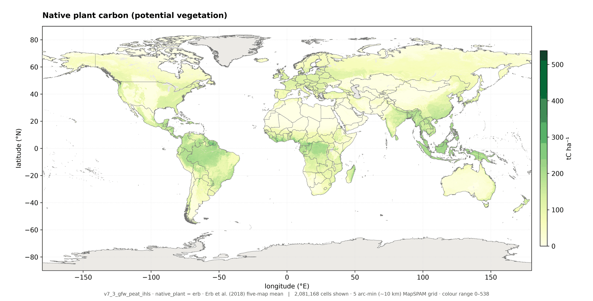

The five-map mean of Erb et al. (2018), in tC/ha. Shared by every crop.

**Figure A-2 | Native soil carbon, soybean**

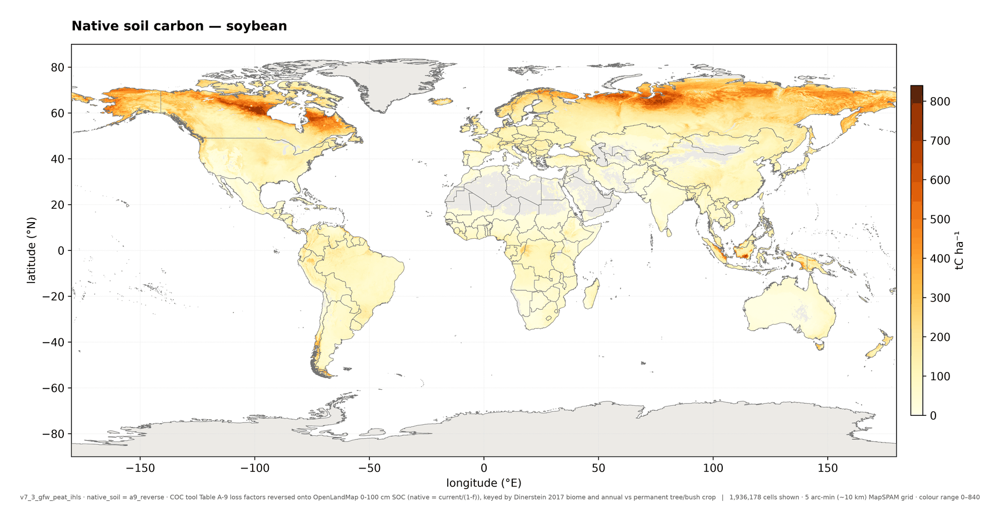

Table A-9 reversed onto the measured agricultural stock, for an annual crop, on the same scale as Figure A-4.
This layer is Figure A-4 rescaled by 1/(1 − *f*) with six biome constants; the steps visible are biome
boundaries, not administrative ones.

**Figure A-3 | Agricultural plant carbon, soybean**

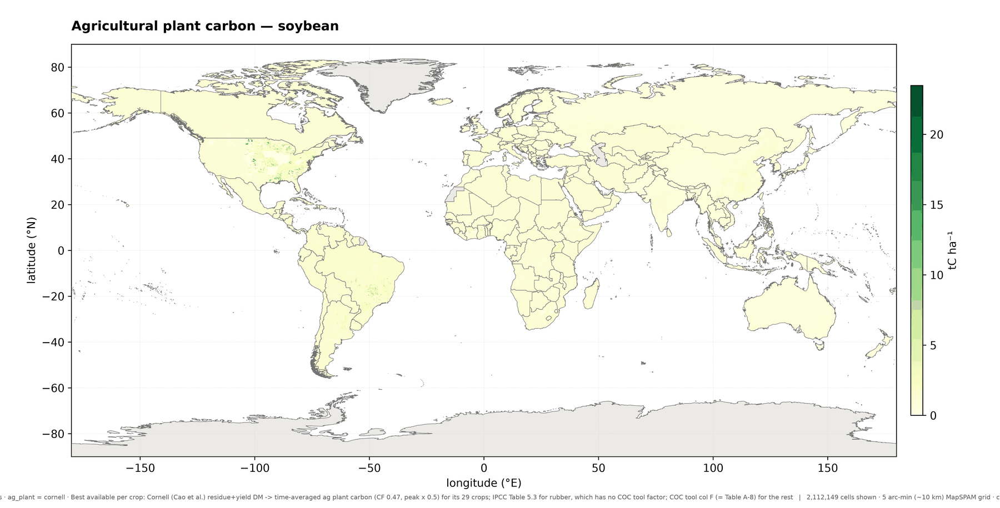

From Cao et al. (2026) where that dataset maps soybean, and from the COC tool's Table A-8 factor elsewhere.
For an annual row crop this pool is an order of magnitude smaller than the soil pools; its weight is in the
tree crops.

**Figure A-4 | Agricultural soil carbon**

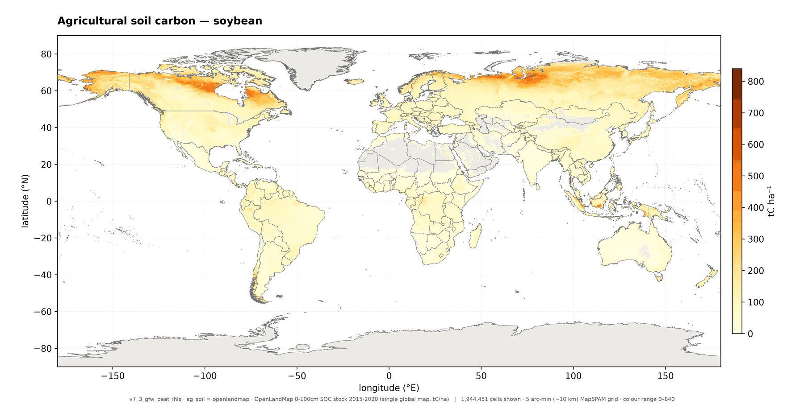

OpenLandMap-soildb 0–100 cm soil organic carbon, 2015–2020, shared by every crop. The very high values in the
boreal belt and the Southeast Asian lowlands are organic soils, the reason the carve-out exists.

**Figure A-5a | COC per hectare, soybean, everywhere the inputs overlap**

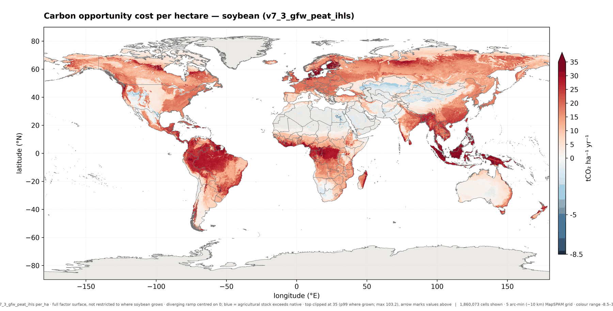

A counterfactual surface: the carbon that *would* be forgone per hectare if soybean were grown in each cell,
drawn on a diverging ramp centred on zero and clipped at the 99th percentile of grown cells. The high values
across the Congo Basin, interior Amazon and Borneo reflect native carbon stocks, not soybean cultivation.

**Figure A-5b | COC per hectare, soybean, where soybean is grown**

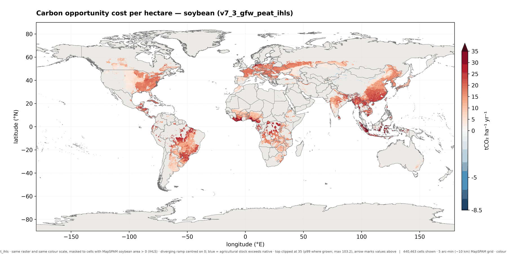

The same raster and colour range, restricted to cells where MapSPAM reports soybean physical area: the
realized footprint, and the one consistent with the aggregated factors.

**Figures A-6a to A-6c | The same values at three scales: Brazil**

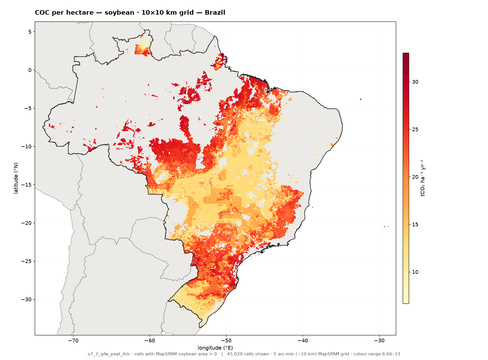
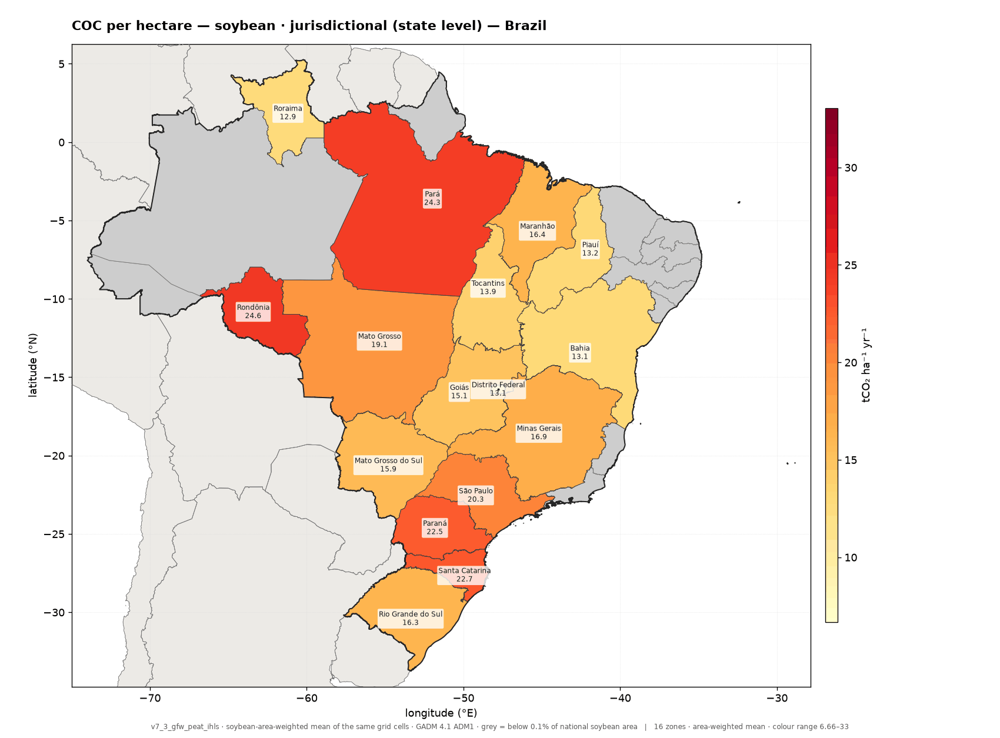
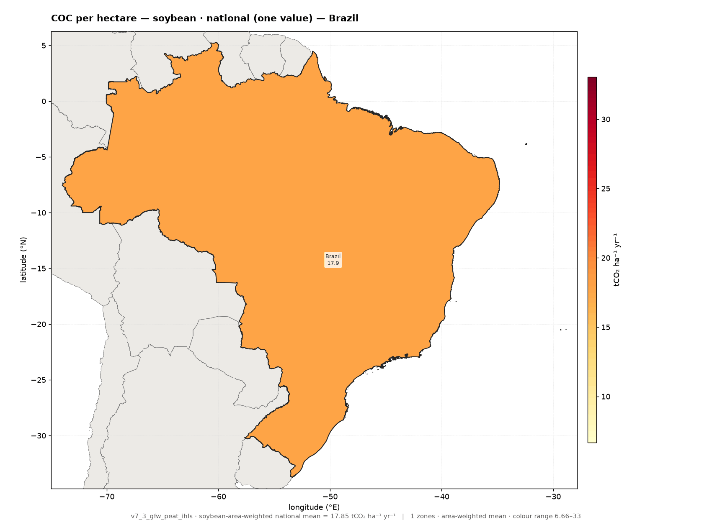

Soybean COC per hectare in Brazil at grid-cell, state and national level, on one shared colour scale, the
aggregated panels being the cells of the first averaged with physical area as the weight. Brazilian soybean
cells span about 7 to 33 tCO2e/ha/year; the national factor is about 18. The reporting scale, not the data,
decides how much of that variation a user sees.

**Figure A-6d | National means, worldwide**

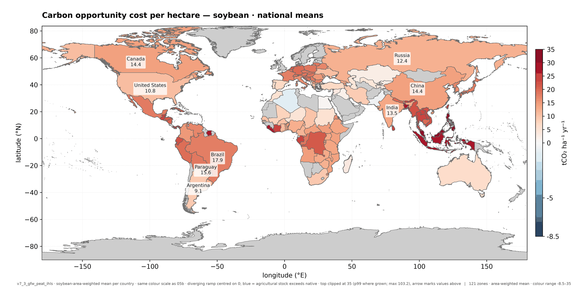

The national step repeated for every producer, on the scale of Figure A-5b. Per-hectare and per-tonne factors
rank countries differently: Argentina and the United States have low per-hectare *and* per-tonne factors,
while India's per-tonne factor is high because its yields are low.

**Figure A-7 | Drained agricultural organic soil, share of each cell**

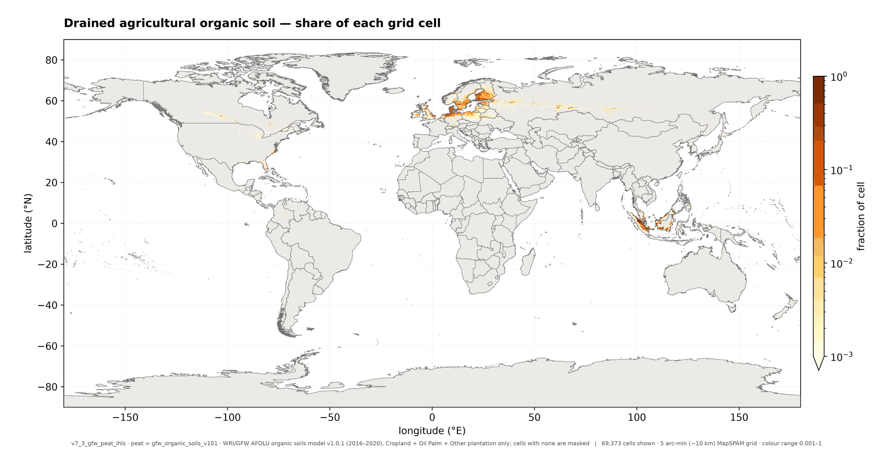

The extent layer behind Equation 6, on a logarithmic scale because the fractions span three orders of
magnitude. This is the share of the *cell*; the calculation re-expresses it as a share of the cell's crop
area before use.

## References

Cao, P., F. Bilotto, C. Gonzalez Fischer, et al. 2026. "Spatially Explicit Global Assessment of Cropland
Greenhouse Gas Emissions circa 2020." *Nature Climate Change* 16: 354–63. https://doi.org/10.1038/s41558-026-02558-4

Dinerstein, E., D. Olson, A. Joshi, C. Vynne, N.D. Burgess, E. Wikramanayake, N. Hahn, et al. 2017. "An
Ecoregion-Based Approach to Protecting Half the Terrestrial Realm." *BioScience* 67 (6): 534–45.
https://doi.org/10.1093/biosci/bix014

Erb, K.-H., T. Kastner, C. Plutzar, et al. 2018. "Unexpectedly Large Impact of Forest Management and Grazing
on Global Vegetation Biomass." *Nature* 553: 73–76. https://doi.org/10.1038/nature25138

GADM. Database of Global Administrative Areas, version 4.1. https://gadm.org

Hengl, T., D. Consoli, X. Tian, T.W. Nauman, M. Nussbaum, M.S. Isik, L. Parente, et al. 2026.
"OpenLandMap-soildb: Global Soil Information at 30 m Spatial Resolution for 2000–2022+ Based on
Spatiotemporal Machine Learning and Harmonized Legacy Soil Samples and Observations." *Earth System Science
Data* 18: 989–1036. https://doi.org/10.5194/essd-18-989-2026

International Food Policy Research Institute (IFPRI). 2026. "Global Spatially-Disaggregated Crop Production
Statistics Data for 2020 Version 2.0 Release 2." Harvard Dataverse, V5. https://doi.org/10.7910/DVN/SWPENT

IPCC. 2014. *2013 Supplement to the 2006 IPCC Guidelines for National Greenhouse Gas Inventories: Wetlands.*
Hiraishi, T., et al. (eds.). Geneva: IPCC.

IPCC. 2019. *2019 Refinement to the 2006 IPCC Guidelines for National Greenhouse Gas Inventories*, Volume 4,
Chapter 5, Table 5.3.

Sanderman, J., T. Hengl, and G.J. Fiske. 2017. "Soil Carbon Debt of 12,000 Years of Human Land Use." *PNAS*
114 (36): 9575–80. https://doi.org/10.1073/pnas.1706103114

Searchinger, T.D., S. Wirsenius, T. Beringer, and P. Dumas. 2018. "Assessing the Efficiency of Changes in Land
Use for Mitigating Climate Change." *Nature* 564: 249–53. https://doi.org/10.1038/s41586-018-0757-z

Wirsenius, S., et al. 2025. Code release behind the carbon opportunity cost tool. Zenodo.
https://doi.org/10.5281/zenodo.15305575

World Resources Institute / Global Forest Watch. 2026. AFOLU Organic Soils Flux Model, version 1.0.1 (run
ogh_mixed_f1_f15_f2_20260513, period 2016–2020, as corrected 26 August 2026). `s3://gfw2-data`.
